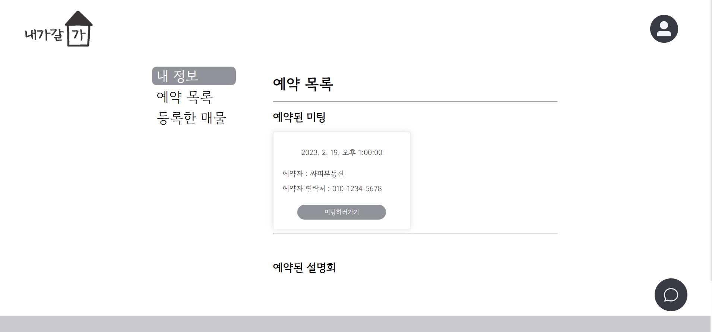
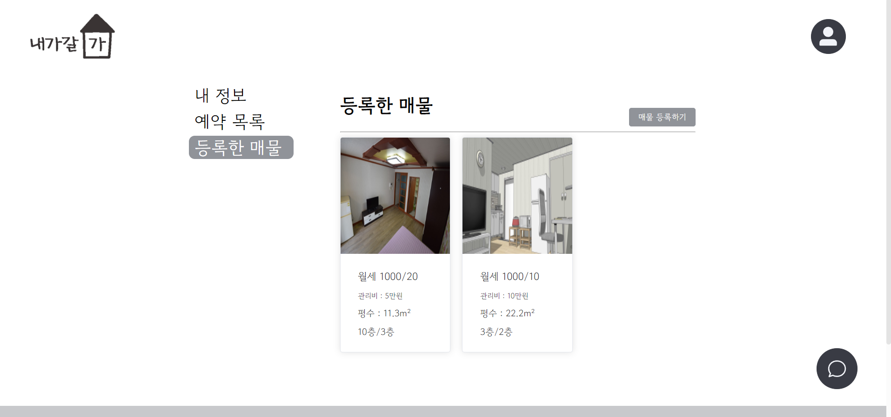

# 내가갈가[家]

## 프로젝트 소개 UCC

## 개요

---

내가갈가[家]는 사용자가 원하는 지역의 집을 직접 확인할 수 없는 상황일 때, 다양한 부동산 데이터베이스와 채팅을 통한 미팅 예약 기능, 판매자와의 실시간 화상 미팅 서비스를 바탕으로 언제 어디서나 편리한 중개서비스를 이용 가능한 웹 서비스 입니다.

## 프로젝트 진행 기간

---

SSAFY 8기 공통 프로젝트
2023.01.03 ~ 2023.02.17

## 서비스 기능

---

- 메인화면 

  

- 회원가입 

  

  꼼꼼한 유효성 검사를 거친후 회원가입을 할 수 있습니다.

- 로그인 
  
  

- 내 정보 조회 

  

- 예약 목록 

  

- 내가 등록한 부동산 매물 목록

  

- 부동산 매물 등록 

  

  사용자는 자신이 판매하고자 하는 부동산 매물을 사이트에 등록할 수 있습니다. 반려동물, 엘리베이터 유무, 옵션 등 매물에 대한 자세한 정보를 등록할 수 있습니다.

- 부동산 매물 검색 

  

  다른 사용자가 올린 매물을 검색할 수 있습니다. 지역을 기준으로 매물 정보를 검색하고 지도에서 확인할 수 있습니다.

- 부동산 매물 정보 상세 조회 

  

  매물에 엘리베이터는 있는지, 반려동물은 키울 수 있는지, 건물의 전체 층수는 몇층인지 등에 대한 정보를 확인할 수 있습니다.

- 부동산 매물 설명회 

  

  여러 사람에게 자신의 부동산 매물을 소개하고 싶다면 설명회를 등록해 참여할 사람을 모을 수 있습니다.

- 판매자에게 문의 

  

  마음에 드는 매물을 찾으면 판매자에게 문의를 할 수 있습니다. 실시간 채팅을 지원합니다.

- 미팅 예약 

  

  판매자와 미팅을 잡을 수 있습니다. 판매자와 문의를 해 날짜와 시간을 정하고 미팅을 잡으세요!

- 화상 미팅 

  

  화상 미팅을 통해 직접 매물을 확인해보세요. 필요한 경우 채팅으로 소통할 수 있습니다.

## 기술 스택

---

### Front End

- Node.js 18.13.0
- Vue 3.2.13
- Element-Plus 2.2.28
- axios 1.2.2
- Vuex 4.0.0
- Vuex-persistedstate 4.1.0
- Typescript 4.5.5
- prettier 2.4.1
- eslint 7.32.0

### Back End

- Azul Zulu Version 15.0.9
- Spring Boot 2.7.7 gradle
- Spring Data JPA
- Lombok
- JWT
- redis

### Infra

- AWS EC2
- Docker
- Nginx

### WebRTC

- OpenVidu

## 협업 툴

---

Jira  
Mattormost 
[Notion](https://www.notion.so/a9346084e7654198b687aea463b1f9b3)  
[Figma](https://www.figma.com/file/1OzKIhJ2Yiy2K9oAivbDtd/%EB%82%B4%EA%B0%80-%EA%B0%88%EA%B0%80%5B%E5%AE%B6%5D?node-id=0%3A1&t=jBHawAhdVHMHORRG-1)  
Slack  
Postman  

## 팀원 소개

---

<table>
  <tbody>
    <tr>
      <td>박재희</td>
      <td>백소원</td>
      <td>신동윤</td>
      <td>오민준</td>
      <td>이준</td>
      <td>이흥종</td>
    </tr>
    <tr>
      <td>팀장  front-end 파트장  full-stack</td>
      <td>front-end</td>
      <td>back-end</td>
      <td>front-end</td>
      <td>back-end  back-end 파트장</td>
      <td>back-end</td>
    </tr>
  <tbody>
</table>

**박재희**

- (FE, BE) 부동산 매물 정보 등록, 삭제, 상세 정보 조회 구현
- (FE, BE) 판매자가 자신의 매물에 설명회 등록, 삭제 구현
- (FE, BE) 구매자가 매물의 설명회에 예약 등록, 삭제 구현
- (BE) 저장된 이미지를 URL 형태로 요청할 수 있도록 API 작성
- (FE) Openvidu를 이용해 일대일 화상 미팅과 채팅 구현

**백소원**

- (FE) 로그인 여부에 따른 메인 화면 구현
- (FE) 매물 정보 검색 화면 구현
- (FE) kakao map API를 이용해 매물 위치 정보에 따른 Custom Overlay Popup 구현
- (FE) SockJS와 stomp를 이용한 실시간 채팅 client 구현

**신동윤**

- (BE) Spring security, JWT, JPA를 이용한 회원가입, 로그인(인증, 인가) 기능 구현
- (BE) JWT, Redis를 이용해 로그아웃된 토큰 재사용 불가 처리 구현
- (BE) 비밀번호 변경, 비밀번호 찾기, 회원정보 CRUD 구현
- (BE) 매물 목록 조회, 회원 정보 조회, 예약목록 조회 API 구현
- (DevOps) Jenkins, Docker를 이용한 CI/CD 구현  
  Docker로 nginx+Vue.js container, spring boot container 생성하여 배포
- (DevOps) Redis를 Docker로 구성
- (DevOps) Nginx 리다이렉트 설정 및 백엔드 및 프론트엔드 url 분기 처리 (/, /api/\*\*)

**오민준**

- (FE) 로그인, 로그아웃, 회원가입, 회원탈퇴 구현
- (FE) 회원정보 입력, 수정시 유효성 검사 추가
- (FE) 내 정보에서 회원 정보 변경, 비밀번호 변경 구현
- (FE) 회원이 등록한 매물 조회, 회원이 예약한 매물 조회 구현
- (FE) 일대다 화상 미팅 화면 구현

**이준**

- (BE) ERD 설계 및 DB 관리
- (BE) kakao local API를 이용한 매물 검색 구현
- (BE) 예약 신청 구현
- (BE) SockJS와 stomp를 이용한 실시간 채팅 server 구현
- (DevOps) MySQL을 Docker로 구성

**이흥종**

- (BE) 부동산 매물 정보 등록, 조회, 삭제 구현
- (BE) Openvidu를 활용한 1:1 미팅
- (DevOps) Openvidu 사용을 위한 인프라 구축
